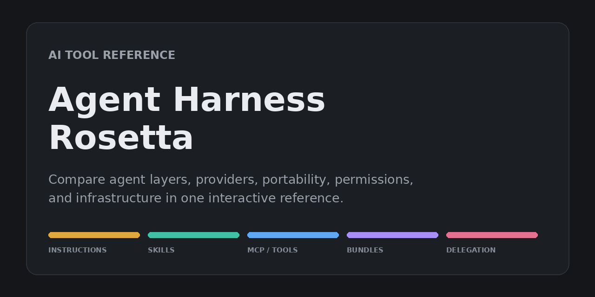

# Agent Harness Rosetta

A dependency-free, interactive reference for comparing AI developer tools.

[View the live reference](https://agent-harness-rosetta.vercel.app) · [Report a correction](https://github.com/stephf0716/agent-harness-rosetta/issues/new)



Use it to see how agent harnesses name and organize their extension layers, which credentials different tools accept, what configuration is portable, what actions run without approval, and how much infrastructure access an agent can receive.

Everything still renders from a single `index.html` file—no framework or build step. The repository now also includes a minimal Node-based verification layer for deterministic tests and optional link checks.

## What it covers

| Reference | Question it answers |
| --- | --- |
| **Harness layers** | How do 13 agent harnesses represent instructions, skills, tool access/MCP, bundles, and delegation? |
| **Provider matrix** | Can a tool use your API key, subscription sign-in, or a built-in provider connection? |
| **Portability** | Which instructions, skills, MCP settings, and agent definitions survive a switch between harnesses? |
| **Permissions** | Will a harness edit files or run shell commands before asking, and what contains it? |
| **Infrastructure** | Which hosting and database platforms provide the capabilities you need, what is free, and what their agent integrations can change or delete? |

The Harness layers reference covers Claude, Codex/ChatGPT, Goose, Hermes Agent, Osaurus, Gemini CLI, Grok Build, Cursor, OpenCode, OpenClaw, GitHub Copilot, Zed, and Pi. Jan appears only in the provider matrix. The provider and infrastructure matrices cover a broader set of AI tools and infrastructure providers.

## Run locally

Clone the repository and open `index.html` in a browser:

```bash
git clone https://github.com/stephf0716/agent-harness-rosetta.git
cd agent-harness-rosetta
open index.html
```

On Windows, use `start index.html`. On Linux, use `xdg-open index.html`.

JavaScript must be enabled. The only external assets are Google Fonts.

## Verification workflow

The site remains static, but the comparison corpus now has lightweight maintenance tooling:

```bash
npm test
npm run check:links
```

- `npm test` runs deterministic corpus and UI-safety checks only. It does **not** touch the network, so it is safe for normal local work and CI.
- `npm run check:links` validates deduplicated external source URLs with retries and `HEAD` → `GET` fallback. Because vendor docs can rate-limit, block bots, or require auth, run it separately from the deterministic test path.

For a concise maintainer guide, see [`docs/verification.md`](./docs/verification.md).

## Using the reference

- Switch among the five tabs; each tab has a stable URL hash.
- Filter the harness, provider, and infrastructure matrices to the tools or capabilities you care about.
- Select cells and rows for source links, qualifications, and fuller explanations.
- Choose dark, light, or system theme.
- Share specific sections with hashes such as `#harnesses`, `#providers`, `#portability`, `#permissions`, `#infra`, or an individual layer such as `#c-mcp`.

Theme and filter selections are saved in `localStorage` when available. The interface supports keyboard navigation and reduced-motion preferences.

## Project structure

| File | Purpose |
| --- | --- |
| `index.html` | Application, styles, data, and rendering logic |
| `package.json` | Minimal Node scripts for deterministic tests and link validation |
| `tests/` | Deterministic Node assertions for the current UI/data contract and provenance invariants |
| `scripts/` | Shared corpus loaders plus the optional external link checker |
| `docs/verification.md` | Maintainer workflow for updating claims and provenance |
| `.github/workflows/` | Deterministic CI plus separate scheduled/manual link validation |
| `social-preview.png` | Repository and README preview image |
| `vercel.json` | Static Vercel configuration and response headers |
| `.vercelignore` | Deployment allowlist; only the site and Vercel config are published |
| `LICENSE` | MIT license for the implementation |
| `LICENSE-CONTENT` | CC BY 4.0 license for reference data and editorial content |

The data model also lives in `index.html`:

- `BUILD` holds the displayed version and fact-check dates.
- `PROVENANCE` resolves source metadata for validation tooling while leaving the existing UI-facing `url`, `status`, and `freeStatus` fields intact.
- `HARNESSES` and `LAYERS` drive the harness comparison.
- `CREDENTIALS`, `TOOLS`, and `MECH` drive the provider matrix.
- `PORTABILITY` and `PERMISSIONS` drive their corresponding tabs.
- `INFRA` drives the capability, free-tier, and blast-radius tables.

A missing harness-layer entry throws instead of silently degrading. Research records can be marked `verified`, `partial`, or `unverified`; caveats for anything short of verified appear in the detail view. Provenance metadata resolves those existing statuses into the explicit evidence labels `primary-docs`, `secondary`, `partial`, and `unknown`.

## Accuracy and scope

This is a point-in-time reference, not a compatibility guarantee. The core dataset was fact-checked against vendor documentation in July 2026, with Grok Build added in August 2026. Some vendor documentation and pricing pages block automated access; affected records are marked `partial` and explain the limitation.

Provider support, product names, permissions, pricing, and free tiers change quickly. Follow the source links in the interface before making a security, purchasing, or architecture decision.

Corrections are welcome. When reporting one, please include the affected row or cell, a primary-source URL, and the date you verified it.

Current migration scope: the new provenance tooling wraps the existing corpus and reports explicit `partial` / `unknown` gaps without inventing stronger sources. Most claims inherit provenance from their existing `url` / `freeUrl` fields; only the already-known gaps currently need per-claim notes, so maintainers can migrate the corpus incrementally instead of rewriting every record at once.

## Deployment

The repository is configured as a static Vercel site:

- Pushes to `main` publish to production.
- Other branches receive preview deployments.
- There is no build command; Vercel serves the repository root.
- `.vercelignore` allowlists `index.html` and `vercel.json`, keeping notes and tooling files out of deployments.

GitHub Actions handles verification separately:

- `deterministic-checks` runs `npm test` on pushes to `main` and on pull requests.
- `link-validation` runs `npm run check:links` on a weekly schedule and on manual dispatch, so routine CI stays deterministic.

## License

The implementation—HTML structure, CSS, and JavaScript rendering logic—is available under the [MIT License](./LICENSE).

The reference data, comparison tables, and editorial content are available under [CC BY 4.0](./LICENSE-CONTENT). You may share and adapt that material, including commercially, with attribution and an indication of changes.

Because both live in `index.html`, the comment at the top of that file is the authoritative boundary: it names which constants are content and which code is implementation. GitHub's sidebar reports only "MIT," as its license detection cannot represent a split.
